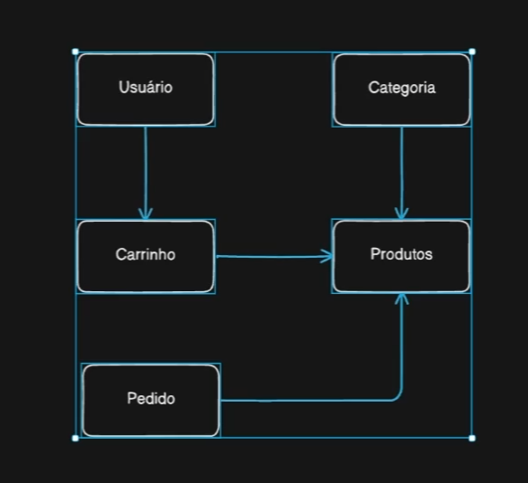

# bearwear

## Requisitos Funcionais
 - SEO (Search Engine Optimization)
 - Usuário deve conseguir fazer login
 - Usuário deve conseguir modificar o carrinho de compras
    - Quantidade de produtos
 - Usuário deve conseguir finalizar um pedido
    - Ter um ou mais produtos
    - Produto poder ter diferentes variantes
 - Usuário deve conseguir fazer o pagamento do pedido
   - Cartão de crédito
 - Usuário deve conseguir gerenciar diferentes endereços de entrega
 - Usuário deve conseguir visualizar seus pedidos feitos

## Requisitos Técnicos
  - React
  - Next.js
  - PostgreSQL
    - ACID Transactions
    - Integridade de dados

