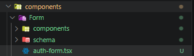
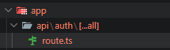

# AUTENTIFICAÇÃO

1 - CRIO A ROTA DE AUTENTICAÇÃO


2 - RODO OS COMANDOS

```
  npm install react-hook-form @hookform/resolvers zod
  npx shadcn add card field input tabs textarea
  npm i better-auth
```

3 - FAÇO A CRIAÇÃO DA ESTRUTURA



4 - FAÇO A CRIAÇÃO DO MEU SCHEMA

```
import * as z from 'zod'

export const loginSchema = z.object({
  email: z.string().email('E-mail inválido'),
  password: z.string().min(8, 'A senha deve ter 8+ caracteres'),
})

export const registerSchema = z
  .object({
    name: z.string().min(3, 'Mínimo 3 caracteres'),
    email: z.string().email('E-mail inválido'),
    password: z.string().min(8, 'A senha deve ter 8+ caracteres'),
    confirmPassword: z.string().min(8, 'Confirme sua senha'),
  })
  .refine((data) => data.password === data.confirmPassword, {
    message: 'As senhas precisam ser iguais',
    path: ['confirmPassword'],
  })

export type LoginValues = z.infer<typeof loginSchema>
export type RegisterValues = z.infer<typeof registerSchema>

```

5 - CRIO O COMPONENTE QUE IRÁ CHAMAR OS FILHOS

```
import { Card, CardContent } from '@/components/ui/card'
import { Tabs, TabsContent, TabsList, TabsTrigger } from '@/components/ui/tabs'

import { LoginForm } from './components/login-form'
import { RegisterForm } from './components/register-form'

export function AuthForm() {
  return (
    <div className="flex w-full justify-center">
      <Tabs
        defaultValue="sign-in"
        className="w-full max-w-md flex flex-col gap-4"
      >
        {/* Tabs Header */}
        <TabsList className="grid w-full grid-cols-2 bg-muted p-1 rounded-lg">
          <TabsTrigger
            value="sign-in"
            className="
              rounded-md px-4 py-2 text-sm font-medium
              transition-all duration-200
              data-[state=active]:bg-background
              data-[state=active]:shadow-sm
              data-[state=active]:text-foreground
              data-[state=inactive]:text-muted-foreground
            "
          >
            Entrar
          </TabsTrigger>

          <TabsTrigger
            value="sign-up"
            className="
              rounded-md px-4 py-2 text-sm font-medium
              transition-all duration-200
              data-[state=active]:bg-background
              data-[state=active]:shadow-sm
              data-[state=active]:text-foreground
              data-[state=inactive]:text-muted-foreground
            "
          >
            Criar conta
          </TabsTrigger>
        </TabsList>

        {/* LOGIN */}
        <TabsContent
          value="sign-in"
          className="
            w-full
            data-[state=active]:animate-in
            data-[state=active]:fade-in
            data-[state=active]:zoom-in-95
          "
        >
          <Card className="border bg-background/95 shadow-lg backdrop-blur">
            <CardContent className="p-6">
              <LoginForm />
            </CardContent>
          </Card>
        </TabsContent>

        {/* REGISTER */}
        <TabsContent
          value="sign-up"
          className="
            w-full
            data-[state=active]:animate-in
            data-[state=active]:fade-in
            data-[state=active]:zoom-in-95
          "
        >
          <Card className="border bg-background/95 shadow-lg backdrop-blur">
            <CardContent className="p-6">
              <RegisterForm />
            </CardContent>
          </Card>
        </TabsContent>
      </Tabs>
    </div>
  )
}

```

6 - CRIO OS COMPONENTES FILHOS

```
'use client'

import { zodResolver } from '@hookform/resolvers/zod'
import { Controller, useForm } from 'react-hook-form'

import { Button } from '@/components/ui/button'
import { CardDescription, CardHeader, CardTitle } from '@/components/ui/card'
import {
  Field,
  FieldContent,
  FieldDescription,
  FieldError,
  FieldGroup,
  FieldLabel,
} from '@/components/ui/field'
import { Input } from '@/components/ui/input'

import { loginSchema, type LoginValues } from '../schema/auth-schemas'

export function LoginForm() {
  const form = useForm<LoginValues>({
    resolver: zodResolver(loginSchema),
    defaultValues: {
      email: '',
      password: '',
    },
  })

  const onSubmit = (data: LoginValues) => {
    console.log('Login:', data)
  }

  return (
    <>
      <CardHeader className="p-0 border-none mb-4">
        <CardTitle>Entrar</CardTitle>
        <CardDescription>Faça login para continuar.</CardDescription>
      </CardHeader>

      <form className="space-y-5" onSubmit={form.handleSubmit(onSubmit)}>
        <FieldGroup>
          <Controller
            name="email"
            control={form.control}
            render={({ field, fieldState }) => (
              <Field data-invalid={fieldState.invalid}>
                <FieldContent>
                  <FieldLabel htmlFor="login-email">E-mail</FieldLabel>
                  <Input
                    {...field}
                    id="login-email"
                    type="email"
                    autoComplete="email"
                    placeholder="voce@exemplo.com"
                    aria-invalid={fieldState.invalid}
                  />
                  {fieldState.invalid && (
                    <FieldError errors={[fieldState.error]} />
                  )}
                </FieldContent>
              </Field>
            )}
          />

          <Controller
            name="password"
            control={form.control}
            render={({ field, fieldState }) => (
              <Field data-invalid={fieldState.invalid}>
                <FieldContent>
                  <FieldLabel htmlFor="login-password">Senha</FieldLabel>
                  <Input
                    {...field}
                    id="login-password"
                    type="password"
                    autoComplete="current-password"
                    placeholder="Sua senha"
                    aria-invalid={fieldState.invalid}
                  />
                  <FieldDescription>Use a senha da sua conta.</FieldDescription>
                  {fieldState.invalid && (
                    <FieldError errors={[fieldState.error]} />
                  )}
                </FieldContent>
              </Field>
            )}
          />
        </FieldGroup>

        <Button className="w-full" type="submit">
          Entrar
        </Button>
      </form>
    </>
  )
}

```

```
'use client'

import { zodResolver } from '@hookform/resolvers/zod'
import { Controller, useForm } from 'react-hook-form'

import { Button } from '@/components/ui/button'
import {
  Field,
  FieldContent,
  FieldDescription,
  FieldError,
  FieldGroup,
  FieldLabel,
} from '@/components/ui/field'
import { Input } from '@/components/ui/input'

import { registerSchema, type RegisterValues } from '../schema/auth-schemas'

export function RegisterForm() {
  const form = useForm<RegisterValues>({
    resolver: zodResolver(registerSchema),
    defaultValues: {
      name: '',
      email: '',
      password: '',
      confirmPassword: '',
    },
  })

  const onSubmit = (data: RegisterValues) => {
    console.log('Register:', data)
  }

  return (
    <form className=" space-y-5" onSubmit={form.handleSubmit(onSubmit)}>
      <FieldGroup className="gap-4">
        <div className="grid gap-4 md:grid-cols-2">
          <Controller
            name="name"
            control={form.control}
            render={({ field, fieldState }) => (
              <Field data-invalid={fieldState.invalid}>
                <FieldContent>
                  <FieldLabel htmlFor="register-name">Nome</FieldLabel>
                  <Input
                    {...field}
                    id="register-name"
                    autoComplete="name"
                    placeholder="Seu nome"
                    aria-invalid={fieldState.invalid}
                  />
                  {fieldState.invalid && (
                    <FieldError errors={[fieldState.error]} />
                  )}
                </FieldContent>
              </Field>
            )}
          />

          <Controller
            name="email"
            control={form.control}
            render={({ field, fieldState }) => (
              <Field data-invalid={fieldState.invalid}>
                <FieldContent>
                  <FieldLabel htmlFor="register-email">E-mail</FieldLabel>
                  <Input
                    {...field}
                    id="register-email"
                    type="email"
                    autoComplete="email"
                    placeholder="voce@exemplo.com"
                    aria-invalid={fieldState.invalid}
                  />
                  {fieldState.invalid && (
                    <FieldError errors={[fieldState.error]} />
                  )}
                </FieldContent>
              </Field>
            )}
          />
        </div>

        <Controller
          name="password"
          control={form.control}
          render={({ field, fieldState }) => (
            <Field data-invalid={fieldState.invalid}>
              <FieldContent>
                <FieldLabel htmlFor="register-password">Senha</FieldLabel>
                <Input
                  {...field}
                  id="register-password"
                  type="password"
                  autoComplete="new-password"
                  placeholder="Mínimo de 8 caracteres"
                  aria-invalid={fieldState.invalid}
                />
                <FieldDescription>Mínimo de 8 caracteres.</FieldDescription>
                {fieldState.invalid && (
                  <FieldError errors={[fieldState.error]} />
                )}
              </FieldContent>
            </Field>
          )}
        />

        <Controller
          name="confirmPassword"
          control={form.control}
          render={({ field, fieldState }) => (
            <Field data-invalid={fieldState.invalid}>
              <FieldContent>
                <FieldLabel htmlFor="register-confirm-password">
                  Confirmar senha
                </FieldLabel>
                <Input
                  {...field}
                  id="register-confirm-password"
                  type="password"
                  autoComplete="new-password"
                  placeholder="Repita sua senha"
                  aria-invalid={fieldState.invalid}
                />
                {fieldState.invalid && (
                  <FieldError errors={[fieldState.error]} />
                )}
              </FieldContent>
            </Field>
          )}
        />
      </FieldGroup>

      <Button className="w-full" type="submit">
        Criar conta
      </Button>
    </form>
  )
}

```

7 - CRIO O MEU .ENV DO BETTER_AUTH

```

BETTER_AUTH_SECRET=WDAWDAWDAWDAWBDHBHWBD2HBQHWBDBBD3

```

8 - EM lib\auth.ts

```
import { betterAuth } from 'better-auth'
import { drizzleAdapter } from 'better-auth/adapters/drizzle'

import { db } from '@/db' // your drizzle instance

export const auth = betterAuth({
  database: drizzleAdapter(db, {
    provider: 'pg', // or "mysql", "sqlite"
  }),
})
```

9 - RODO O COMANDO

```
  npx @better-auth/cli generate
```

10 - PEGO AS TABELAS CRIADAS NO auth-schema.ts E COLOCO NO schema.ts que fica dentro do db

```
import { relations } from 'drizzle-orm'
import {
  boolean,
  index,
  integer,
  pgTable,
  text,
  timestamp,
  uuid,
} from 'drizzle-orm/pg-core'

export const categoryTable = pgTable('categories', {
  id: uuid().primaryKey().defaultRandom(),
  name: text().notNull(),
  slug: text().notNull().unique(),
  createdAt: timestamp('created_at').notNull().defaultNow(),
})

export const categoryRelations = relations(categoryTable, ({ many }) => ({
  products: many(productTable),
}))

export const productTable = pgTable('products', {
  id: uuid().primaryKey().defaultRandom(),
  categoryId: uuid('category_id')
    .notNull()
    .references(() => categoryTable.id, { onDelete: 'set null' }),
  name: text().notNull(),
  slug: text().notNull().unique(),
  description: text().notNull(),
  createdAt: timestamp('created_at').notNull().defaultNow(),
})

export const productRelations = relations(productTable, ({ one, many }) => ({
  category: one(categoryTable, {
    fields: [productTable.categoryId],
    references: [categoryTable.id],
  }),
  variants: many(productVariantTable),
}))

export const productVariantTable = pgTable('product_variant', {
  id: uuid().primaryKey().defaultRandom(),
  productId: uuid('product_id')
    .notNull()
    .references(() => productTable.id, { onDelete: 'cascade' }),
  name: text().notNull(),
  slug: text().notNull().unique(),
  color: text().notNull(),
  priceInCents: integer('price_in_cents').notNull(),
  imageUrl: text('image_url').notNull(),
  createdAt: timestamp('created_at').notNull().defaultNow(),
})

export const productVariantRelations = relations(
  productVariantTable,
  ({ one }) => ({
    product: one(productTable, {
      fields: [productVariantTable.productId],
      references: [productTable.id],
    }),
  }),
)

export const userTable = pgTable('user', {
  id: text('id').primaryKey(),
  name: text('name').notNull(),
  email: text('email').notNull().unique(),
  emailVerified: boolean('email_verified').default(false).notNull(),
  image: text('image'),
  createdAt: timestamp('created_at').defaultNow().notNull(),
  updatedAt: timestamp('updated_at')
    .defaultNow()
    .$onUpdate(() => /* @__PURE__ */ new Date())
    .notNull(),
})

export const sessionTable = pgTable(
  'session',
  {
    id: text('id').primaryKey(),
    expiresAt: timestamp('expires_at').notNull(),
    token: text('token').notNull().unique(),
    createdAt: timestamp('created_at').defaultNow().notNull(),
    updatedAt: timestamp('updated_at')
      .$onUpdate(() => /* @__PURE__ */ new Date())
      .notNull(),
    ipAddress: text('ip_address'),
    userAgent: text('user_agent'),
    userId: text('user_id')
      .notNull()
      .references(() => userTable.id, { onDelete: 'cascade' }),
  },
  (table) => [index('session_userId_idx').on(table.userId)],
)

export const account = pgTable(
  'account',
  {
    id: text('id').primaryKey(),
    accountId: text('account_id').notNull(),
    providerId: text('provider_id').notNull(),
    userId: text('user_id')
      .notNull()
      .references(() => userTable.id, { onDelete: 'cascade' }),
    accessToken: text('access_token'),
    refreshToken: text('refresh_token'),
    idToken: text('id_token'),
    accessTokenExpiresAt: timestamp('access_token_expires_at'),
    refreshTokenExpiresAt: timestamp('refresh_token_expires_at'),
    scope: text('scope'),
    password: text('password'),
    createdAt: timestamp('created_at').defaultNow().notNull(),
    updatedAt: timestamp('updated_at')
      .$onUpdate(() => /* @__PURE__ */ new Date())
      .notNull(),
  },
  (table) => [index('account_userId_idx').on(table.userId)],
)

export const verification = pgTable(
  'verification',
  {
    id: text('id').primaryKey(),
    identifier: text('identifier').notNull(),
    value: text('value').notNull(),
    expiresAt: timestamp('expires_at').notNull(),
    createdAt: timestamp('created_at').defaultNow().notNull(),
    updatedAt: timestamp('updated_at')
      .defaultNow()
      .$onUpdate(() => /* @__PURE__ */ new Date())
      .notNull(),
  },
  (table) => [index('verification_identifier_idx').on(table.identifier)],
)

export const userRelations = relations(userTable, ({ many }) => ({
  sessions: many(sessionTable),
  accounts: many(account),
}))

export const sessionRelations = relations(sessionTable, ({ one }) => ({
  user: one(userTable, {
    fields: [sessionTable.userId],
    references: [userTable.id],
  }),
}))

export const accountRelations = relations(account, ({ one }) => ({
  user: one(userTable, {
    fields: [account.userId],
    references: [userTable.id],
  }),
}))

```

11 - ATUALIZO O BANCO

```
  npx drizzle-kit push
```

12 - SEGUINDO A DOCUMENTAÇÃO CRIO A SEGUINTE ESTRUTURA DE PASTA



```
import { auth } from "@/lib/auth";
import { toNextJsHandler } from "better-auth/next-js";

export const { GET, POST } = toNextJsHandler(auth);
```

13 - SEGUINDO A DOC CRIO DENTRO DE LIB UM auth.ts E ADICIONO A CONFIGURAÇÃO DE AUTENTICAÇÃO QUE DESEJA

```

import { betterAuth } from 'better-auth'
import { drizzleAdapter } from 'better-auth/adapters/drizzle'

import { db } from '@/app/db'

export const auth = betterAuth({
  emailAndPassword: {
    enabled: true,
  },
  database: drizzleAdapter(db, {
    provider: 'pg',
  }),
})


```

14 - SEGUINDO A DOCUMENTAÇÃO NO FORMULÁRIO CHAMO O BETTER AUTH
``````