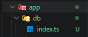
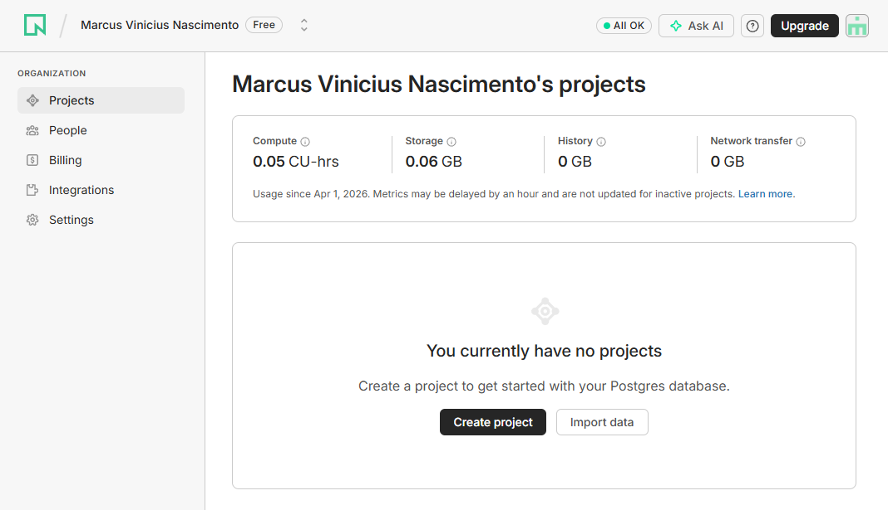
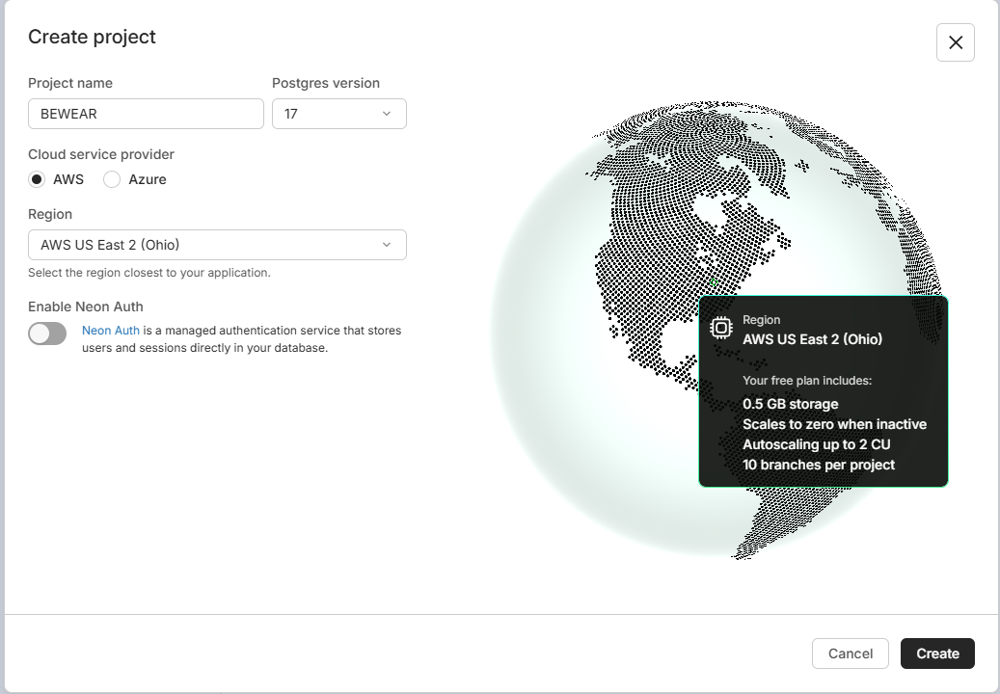
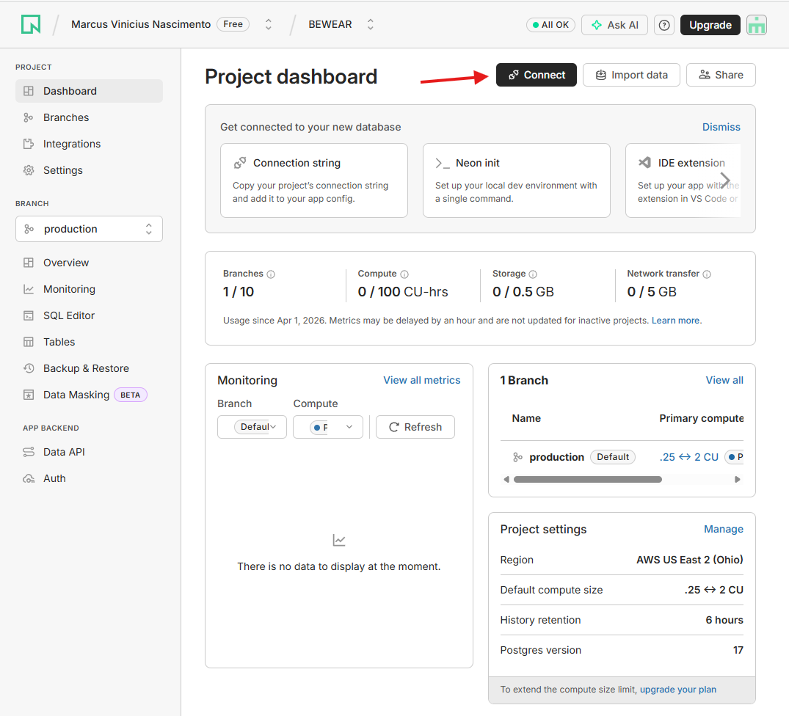
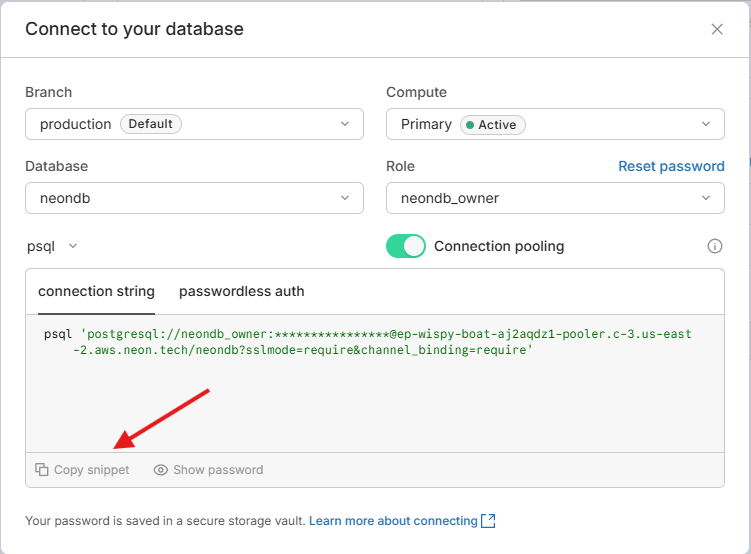

# SETUP DRIZZLE

```

//COMANDOS

npm i drizzle-orm drizzle-seed pg dotenv
npm i -D drizzle-kit tsx @types/pg


```

1 - CRIO A ESTRUTURA DE PASTAS DA IMAGEM ABAIXO



2 - CRIO UM .env NA RAIZ

3 - CONFIGURO O NEON DB(SERVIÇO CLOUD 0800 PARA POSTGRES)

https://console.neon.tech/app/org-little-sky-03363490/projects








4 - ADICIONO A URL NO .env

5 - CRIO O drizzle.config.ts NA RAIZ DO PROJETO e CONFIGURO O index.ts

```
import 'dotenv/config';
import { defineConfig } from 'drizzle-kit';

export default defineConfig({
  out: './drizzle',
  schema: './app/db/schema.ts',
  dialect: 'postgresql',
  dbCredentials: {
    url: process.env.DATABASE_URL!,
  },
});

```

index.ts

```
import 'dotenv/config';
import { drizzle } from 'drizzle-orm/node-postgres';
const db = drizzle(process.env.DATABASE_URL!);

```

6 - CRIO O MEU schema.ts, arquivo que cria as tables

```

import { relations } from 'drizzle-orm'
import { integer, pgTable, text, timestamp, uuid } from 'drizzle-orm/pg-core'

export const userTable = pgTable('users', {
  id: uuid().primaryKey().defaultRandom(),
  name: text().notNull(),
})

export const categoryTable = pgTable('categories', {
  id: uuid().primaryKey().defaultRandom(),
  name: text().notNull(),
  slug: text().notNull().unique(),
  createdAt: timestamp().notNull().defaultNow(),
})

export const categoryRelations = relations(categoryTable, ({ many }) => ({
  products: many(productTable),
}))

export const productTable = pgTable('products', {
  id: uuid().primaryKey().defaultRandom(),
  categoryId: uuid('category_id')
    .notNull()
    .references(() => categoryTable.id),
  name: text().notNull(),
  slug: text().notNull().unique(),
  description: text().notNull(),
  createdAt: timestamp('created_at').notNull().defaultNow(),
})

export const productRelations = relations(productTable, ({ one, many }) => ({
  category: one(categoryTable, {
    fields: [productTable.categoryId],
    references: [categoryTable.id],
  }),
  variants: many(productVariantTable),
}))

export const productVariantTable = pgTable('product_variant', {
  id: uuid().primaryKey().defaultRandom(),
  productId: uuid('product_id')
    .notNull()
    .references(() => productTable.id),
  name: text().notNull(),
  slug: text().notNull().unique(),
  color: text().notNull(),
  priceInCents: integer('price_in_cents').notNull(),
  imageUrl: text('image_url').notNull(),
  createdAt: timestamp('created_at').notNull().defaultNow(),
})

export const productVariantRelations = relations(
  productVariantTable,
  ({ one }) => ({
    product: one(productTable, {
      fields: [productVariantTable.productId],
      references: [productTable.id],
    }),
  }),
)

```

7 - CRIO AS MINHAS SEEDS seed.ts

8 - RODO O COMANDO PARA PEGAR O SCHEMA E CRIAR AS TABELAS

```

npx drizzle-kit push

```

9 - RODO O COMANDO O COMANDO, ESSE COMANDO PERMITI VERIFICAR AS TABELAS

````
  npx drizzle-kit studio
```

10 -  CASO QUEIRA REALIZAR ALGUMA MUDANÇA NO SCHEMA E NECESSÁRIO RODAR O COMANDO

```
  npx drizzle-kit push
```

11 - AGORA VAMOS SUBIR AS NOSSAS SEEDS PARA O BANCO

```
  npx tsx --env-file=.env app/db/seed.ts

```
````
